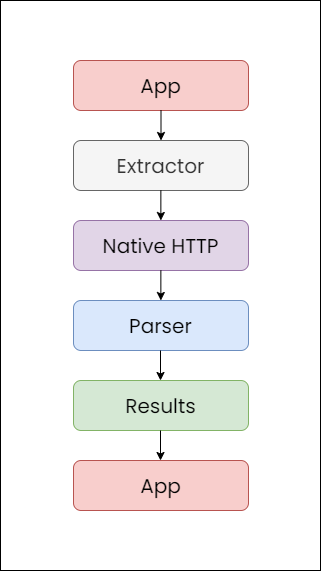

# How does it work?

## Overview

Yukino does not depend on any kind API service, rather scrapes the sites directly. Everything is done within the application. Does this benefit? It depends. The application is rather fast without depending on an external API. At the same time, it is slower due to lack of caching results.

## The flow

