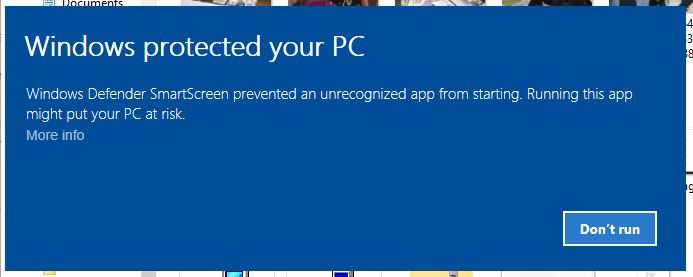
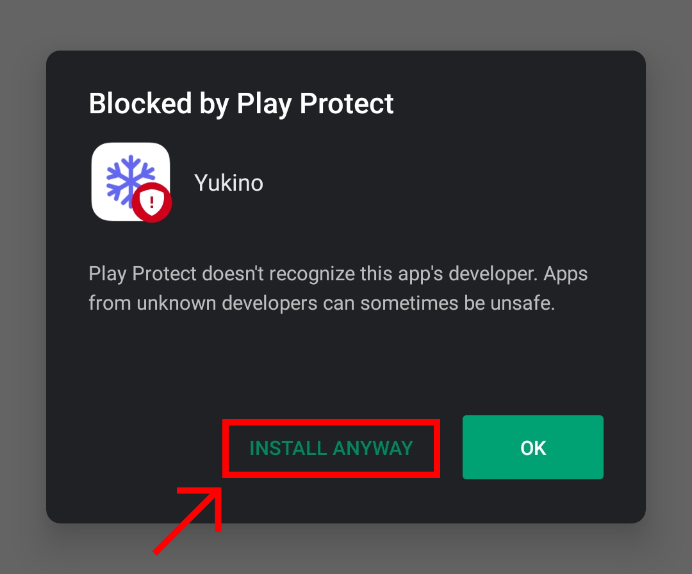

# Installation

## Requirements

### Windows

-   Hardware:

    -   Intel Pentium 4 processor or better
    -   Minimum 512 MB of RAM

-   Software:

    -   Windows 7 SP1 or newer (only 64-bit is supported)

### Linux

-   Hardware:

    -   An Intel Pentium 4 processor or better

-   Software:

    -   Any linux-based distro (64-bit)

### Android

-   Hardware:

    -   Minimum 512 MB of RAM

-   Software:

    -   Android 4.1 or newer

## Downloading

Download the corresponding file from [here](https://yukino-app.github.io/download/latest) and install it after the download is complete.

### Blocked by Windows SmartScreen

#### Why do I see this warning?

Windows SmartScreen warns user when installing a unsigned `.exe`. This warning can be ignored. Click on `More info` which gives an `Run anyway` option that can be used to install forcefully.

### Blocked by Android Play Protect

#### Why do I see this warning?

Google Play Protect warns user when installing a `.apk` from unknown developers. This warning can be ignored.
