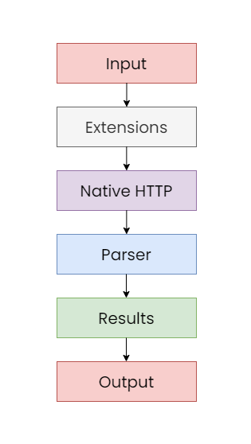

# How does it work?

## Overview

Yukino does not have any content itself. It uses extensions to add functionality to the app. Extensions are not packed into the app but is fetched from [yukino-app/extensions-store](https://github.com/yukino-app/extensions-store) at _runtime_.

## The flow

